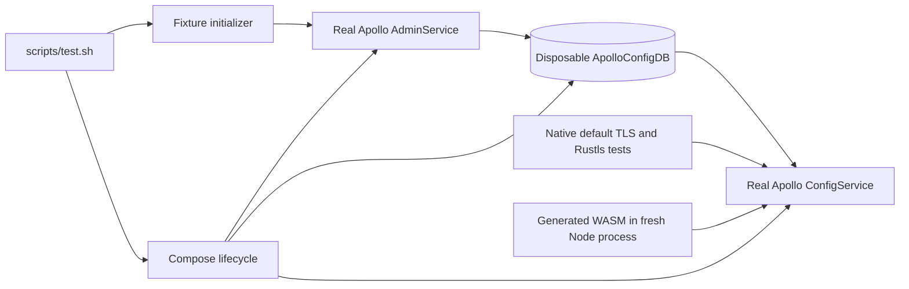

# Implementation Plan: Real Apollo integration testing

**Feature**: [005-real-apollo-testing](spec.md)
**Status**: Proposed technical handoff; no implementation or runtime validation performed
**Baseline**: `f3c3f4e` on 2026-09-06
**Task list**: [tasks.md](tasks.md) is the authoritative implementation checklist.

## 1. Outcome and Boundaries

Use Docker Compose to run official Apollo ConfigService and AdminService images sharing a disposable MySQL database. Initialize schema from a pinned upstream file, create fixtures through AdminService, publish actual releases, and validate them through ConfigService. Run native default-TLS, native Rustls, and a fresh Node process loading generated WASM bindings against those same fixtures.

Retain a fast suite for deterministic fault and unit cases. The default `scripts/test.sh` will run all required checks; `scripts/test.sh fast` and `scripts/test.sh integration` select explicit subsets. These mode defaults and the retained-mock boundary are proposals documented in the spec, not user-confirmed answers. This session changes only planning documents and the specification index.

### Existing evidence that affects the migration

| Location | Observation and implication |
|---|---|
| `8b9bc9e` and its parent | The immediately preceding Docker setup ran WireMock. The later commit removed it and added in-process mocks. Do not restore that Compose file as if it were real Apollo. |
| `src/test_support.rs` | `MockHttpsServer` supports useful fault injection, but `apollo_response` fabricates format/grayscale responses and does not validate signatures. A successful “with secret” read currently proves no server-side authorization. |
| `src/lib.rs::setup` | WASM unit tests replace global `fetch`. The real WASM suite must be a separate process that never calls this setup. |
| `src/lib.rs::tests` | Format, authenticated-read, and grayscale tests are mixed with fault/lifecycle tests. `test_custom_refresh_interval` uses mock request counters. |
| `src/namespace/{json,yaml}.rs` | Each has a network-backed `test_namespace_to_object` using `crate::tests::client_no_secret`; migration must remove that dependency while retaining pure conversion tests. |
| `scripts/test.sh` | Three Clippy modes, default native tests, doctests, and mocked Node WASM library tests run today. Rustls is linted but not tested at runtime. |
| `.github/workflows/rust.yml` | Linux quality/build/test jobs already exist. The test job calls `scripts/test.sh`; retain that job identity and add explicit prerequisites/diagnostics there. |
| `spec/supporting/research.md` | D-007: cache identity excludes secrets. Negative authentication tests require different empty cache directories/process-local storage. Other open decisions remain outside scope. |

This is source/history inspection, not a passing test baseline. The existing traceability document records an earlier dependency-fetch failure; do not reuse it as current runtime evidence.

## 2. Architecture Decisions

### D1 — Three services, one test-owned database

Compose services: `mysql`, `configservice`, `adminservice`. ConfigService and AdminService share `ApolloConfigDB`; use the version-matched MySQL schema, including its normal server configuration defaults. The client talks directly to ConfigService. A test-only Node helper talks to AdminService to create, edit, and publish fixtures.

Portal and PortalDB are unnecessary for this client test scope. Direct AdminService APIs avoid browser login, Portal consumer-token bootstrapping, and a fourth long-running service. This is a deliberate dependency on version-pinned **internal administrative APIs**, not a claim that they are Apollo's public OpenAPI. Keep calls confined to the test tooling. The [AdminService controllers](https://github.com/apolloconfig/apollo/tree/v2.5.2/apollo-adminservice/src/main/java/com/ctrip/framework/apollo/adminservice/controller) implement the required operations.

Alternative considered: ConfigService + SQL release dumps. Rejected because releases, branch relationships, notifications, and runtime publication would be hand-maintained database internals. Another valid alternative is ConfigService/AdminService/Portal/MySQL with public OpenAPI; add that only if later requirements include Portal behavior or require its permission model.

### D2 — Pin upstream artifacts; prove the stack before migrating tests

- Candidate Apollo: `apolloconfig/apollo-configservice:2.5.2` and `apolloconfig/apollo-adminservice:2.5.2`, corresponding to upstream commit `ed9785c87b390c22efece9ea7ec7eeab2d20a042`. This released version was verified in the [official release](https://github.com/apolloconfig/apollo/releases/tag/v2.5.2).
- Candidate database: official MySQL 8.4 LTS, initially resolve the published `8.4.11` tag. Compatibility with this Apollo schema/driver must be demonstrated in T01; a tag appearing in the [official image documentation](https://hub.docker.com/_/mysql) is not runtime proof.
- Resolve and commit **multi-platform index digests** for all three images after inspecting `linux/amd64` and `linux/arm64` availability. Use `image: repository:version@sha256:...`; never leave `latest` or fabricated digests. Apollo's [release image workflow](https://github.com/apolloconfig/apollo/blob/v2.5.2/.github/workflows/docker-publish.yml) builds both architectures, but the actual candidate manifests still require inspection.
- Vendor the exact [MySQL schema at the release commit](https://github.com/apolloconfig/apollo/blob/ed9785c87b390c22efece9ea7ec7eeab2d20a042/scripts/sql/profiles/mysql-default/apolloconfigdb.sql), preserving its license/provenance, and record its SHA-256. Do not download schema from `master` during tests.
- Explicitly select `SPRING_PROFILES_ACTIVE=github,database-discovery` and the matching `APOLLO_PROFILE` value if required by the image startup configuration. The [base application properties](https://github.com/apolloconfig/apollo/blob/v2.5.2/apollo-configservice/src/main/resources/application.properties) group `github` with the MySQL profile; do not accidentally omit database configuration by selecting only discovery. Both [ConfigService](https://github.com/apolloconfig/apollo/blob/v2.5.2/apollo-configservice/src/main/resources/application-database-discovery.properties) and [AdminService](https://github.com/apolloconfig/apollo/blob/v2.5.2/apollo-adminservice/src/main/resources/application-database-discovery.properties) have the database-discovery profile. It removes a separate Eureka dependency. Validate effective startup profiles and property precedence in T01.
- Use Node 24 LTS for test tooling/CI, matching the inspected local Node 24 installation and the [Node release schedule](https://nodejs.org/en/about/previous-releases). This is a test-toolchain choice, not a new library minimum-runtime promise. Require the Compose plugin with `up --wait`, `--wait-timeout`, and `port` support (v2.20+ or later major).

Pinning and schema compatibility are early implementation validations. If a candidate fails, record the concrete failure, choose another fixed compatible official tag, update the plan and provenance, and repeat T01. Do not bypass affected assertions or substitute mocks. A maintainer decision is needed only if the resolution changes agreed scope, such as dropping ARM64 or authentication coverage.

### D3 — Use native host clients and dynamic loopback ports

Both real client processes run on the host, locally and on the Linux GitHub runner. Publish ConfigService container port 8080 and AdminService port 8090 to Docker-assigned host ports on `127.0.0.1`. Discover assignments with `docker compose -f tests/apollo/compose.yaml -p "$APOLLO_TEST_PROJECT" port configservice 8080` and the corresponding AdminService command. Never use host networking, fixed container names, fixed host ports, or Docker-only DNS names in host client configuration.

Database port 3306 remains inside the Compose network. Both Apollo services use a JDBC URL pointing to `mysql:3306/ApolloConfigDB`, explicit test database credentials, and the same schema. Start MySQL only after mounting the schema read-only at `/docker-entrypoint-initdb.d/`; require an authenticated TCP query confirming required tables after initialization before starting Apollo. A bare `mysqladmin ping` is insufficient evidence of completed schema initialization. The [MySQL image documentation](https://hub.docker.com/_/mysql) describes fresh-volume initialization; [Compose readiness documentation](https://docs.docker.com/compose/how-tos/startup-order/) distinguishes a running container from a ready dependency.

Use private project-scoped networks/volumes, no restart policy that hides crashed services, and initially budget about 4 GiB of available Docker memory for the stack. Record actual usage and warm/cold duration in T01/T11; that estimate is not a measured acceptance SLO. Plain HTTP on loopback is sufficient here; existing HTTPS fault tests retain certificate/trust coverage. Never enable an insecure client flag globally for the integration suite.

### D4 — Share fixture administration through dependency-free Node tooling

`scripts/apollo-fixtures.mjs` uses Node built-ins (`fetch`, `crypto`, filesystem, URL) for initialization, verification, bounded polling, and controlled item edits/publications. No npm installation, host Java/MySQL client, or new Rust dependency is required. Native test helpers invoke its narrow mutation commands in a blocking-task boundary with captured output; WASM integration uses the same commands/helper module. Do not add administration to the shipped Rust library.

SQL initializes Apollo's own schema and, only if necessary, test-local `ServerConfig` settings. Application fixtures, keys, branch rules, and releases go through the real AdminService. Keep normal access-key enforcement enabled. Avoid lowering server cache/propagation settings initially; observe real readiness within the stated deadlines instead.

## 3. Fixture Contract

`tests/apollo/fixtures.json` is the versioned declarative source of expected data. Include `schemaVersion: 1`. The initializer receives a per-run ID, adds it as `fixtureRunId`, and records resolved entity IDs/branch names in a run-local `state.json`. Numeric database IDs and generated branch names never belong in the static manifest.

| Application / cluster | Namespace and format | Required content and role |
|---|---|---|
| `101010101` / `default` | `application`, Properties | `stringValue="string value"`, `intValue="42"`, `floatValue="4.20"`, `boolValue="false"`, `grayScaleValue="false"`, `identity="plain-default"`, `fixtureRunId=<run ID>`; no `missingValue` key. |
| `101010102` / `default` | `application`, Properties | Same scalar baseline; `identity="secret-default"`; one enforced key with test-only secret `apollo-integration-only-secret-v1`. |
| `101010101` / `integration` | `application`, Properties | Distinct `identity="plain-integration"` and `stringValue="cluster value"`; explicitly publish this cluster. |
| `101010101` / `default` | `application.json`, JSON | `content` is the JSON string encoding `{ "host": "localhost", "port": 8080, "run": true }`. |
| `101010101` / `default` | `application.yml`, YAML | `content` is `host: "localhost"\nport: 8080\nrun: true\n`. Add `application.yaml` with the same values to exercise the other accepted suffix. |
| `101010101` / `default` | `config.properties`, Properties | `publicValue="properties"`; this is a literal dotted Properties name, not proof of public association. |
| `101010101` / `default` | `readme.txt`, Text | `content="plain text configuration\nsecond line\n"`; assert exact newlines. |
| `101010103` / `default` | `FX.apollo`, public Properties | Owns `publicValue="associated"`, `identity="public-owner"`; consumer app `101010101` has an actual associated namespace. Verify ownership and association through AdminService, not just the dotted name. |
| `101010101` / `default` | `updates-native`, `updates-rustls`, `updates-wasm`, Properties | Each starts with `value="baseline"` and `fixtureRunId=<run ID>`. Separate namespaces for runtime suites; lifecycle cases within each suite are sequential. |

Use `dataChangeCreatedBy` and `dataChangeLastModifiedBy` consistently as `apollo-test`. Administrative display fields use deterministic test values. Node-generated probe signatures are independent of the Rust signer: HMAC-SHA1 with Base64 over timestamp + newline + the exact encoded path/query from [the existing client contract](../supporting/contracts.md).

### Grayscale setup

For **each** of `101010101` and `101010102`, publish the `default/application` baseline, create one child branch, capture its `clusterName` and namespace `id`, set `grayScaleValue="true"` on the branch, and publish that branch. Install rules targeting that app with `clientIpList=["1.2.3.4"]` and `clientLabelList=["GrayScale"]`. Never insert `"*"` to fill an unused dimension. The [rule matcher](https://github.com/apolloconfig/apollo/blob/v2.5.2/apollo-common/src/main/java/com/ctrip/framework/apollo/common/dto/GrayReleaseRuleItemDTO.java) matches the IP or label dimension; negative controls must query `1.2.3.5`, `OtherLabel`, and no targeting.

Verify default, IP match, label match, and nonmatches through ConfigService. Repeat targeted positive reads on the protected app with a signature covering its query. Read back the rule after publication and preserve its actual release ID when reconciling it. Do not assume rule changes are instantly visible.

### Administrative API contract (Apollo 2.5.2)

All paths below are relative to **AdminService**, with no `/openapi/v1` or environment prefix. `N` means `/apps/{app}/clusters/{cluster}/namespaces/{namespace}`. Encode path segments/query values using URL APIs. Check HTTP status, parse/validate required fields, and report body details on errors.

| Operation | Route and essential behavior | Upstream contract |
|---|---|---|
| Create/read app | `POST /apps`; read `GET /apps/{app}`. Supply appId/name/orgId/orgName/ownerName and audit creator. Creation already creates the default cluster and application namespace; read their identities back. | [AppController](https://github.com/apolloconfig/apollo/blob/v2.5.2/apollo-adminservice/src/main/java/com/ctrip/framework/apollo/adminservice/controller/AppController.java), [AdminService](https://github.com/apolloconfig/apollo/blob/v2.5.2/apollo-biz/src/main/java/com/ctrip/framework/apollo/biz/service/AdminService.java) |
| Create cluster | `POST /apps/{app}/clusters`; supply appId/name and audit creator. Read existing clusters before creating. | [ClusterController](https://github.com/apolloconfig/apollo/blob/v2.5.2/apollo-adminservice/src/main/java/com/ctrip/framework/apollo/adminservice/controller/ClusterController.java) |
| Create namespace definition | `POST /apps/{app}/appnamespaces`; supply exact `name`, `appId`, `format`, `isPublic`, and audit creator. Keep ordinary `silentCreation=false`; read instantiated namespaces afterward. | [AppNamespaceController](https://github.com/apolloconfig/apollo/blob/v2.5.2/apollo-adminservice/src/main/java/com/ctrip/framework/apollo/adminservice/controller/AppNamespaceController.java) |
| Associate public namespace | After creating the owner definition, `POST /apps/{consumer}/clusters/default/namespaces` with appId, clusterName, namespaceName=`FX.apollo`, audit creator. Read `/associated-public-namespace` under the consumer namespace to validate the association. | [NamespaceController](https://github.com/apolloconfig/apollo/blob/v2.5.2/apollo-adminservice/src/main/java/com/ctrip/framework/apollo/adminservice/controller/NamespaceController.java) |
| Create/read/edit item | Resolve namespace `id` using `GET N`. Read `GET N/items`; create via `POST N/items` with `namespaceId`, key, string value, audit fields, and normal item type. Update via `PUT N/items/{numericItemId}`, preserving identity and sending value/audit fields. **PUT takes an ID, not a key.** | [ItemController](https://github.com/apolloconfig/apollo/blob/v2.5.2/apollo-adminservice/src/main/java/com/ctrip/framework/apollo/adminservice/controller/ItemController.java) |
| Publish/reconcile release | `POST N/releases?name={title}&operator=apollo-test&isEmergencyPublish=false`; no OpenAPI release JSON body. Read `GET N/releases/latest`; compare its configurations semantically and publish only if needed. A successful save alone never means published. | [ReleaseController](https://github.com/apolloconfig/apollo/blob/v2.5.2/apollo-adminservice/src/main/java/com/ctrip/framework/apollo/adminservice/controller/ReleaseController.java) |
| Create/read branch | `POST N/branches?operator=apollo-test`, `GET N/branches`; consume returned generated clusterName and namespace ID. Edit/publish using the branch cluster in `N`. | [NamespaceBranchController](https://github.com/apolloconfig/apollo/blob/v2.5.2/apollo-adminservice/src/main/java/com/ctrip/framework/apollo/adminservice/controller/NamespaceBranchController.java) |
| Install branch rules | `PUT N/branches/{branchName}/rules` with appId, parent clusterName, namespaceName, branchName, actual releaseId, ruleItems, and audit fields; read the same path to reconcile/verify. | [GrayReleaseRuleDTO](https://github.com/apolloconfig/apollo/blob/v2.5.2/apollo-common/src/main/java/com/ctrip/framework/apollo/common/dto/GrayReleaseRuleDTO.java), branch controller above |
| Enforce test access key | `POST /apps/{app}/accesskeys` with secret, appId, `enabled:true`, `mode:0`, and audit fields. GET existing keys first; enable/update the intended key by its returned ID if needed. `mode:0` is FILTER; observer mode is insufficient. Verify missing/wrong-secret 401 and valid-secret success at ConfigService. | [AccessKeyController](https://github.com/apolloconfig/apollo/blob/v2.5.2/apollo-adminservice/src/main/java/com/ctrip/framework/apollo/adminservice/controller/AccessKeyController.java), [AccessKeyMode](https://github.com/apolloconfig/apollo/blob/v2.5.2/apollo-common/src/main/java/com/ctrip/framework/apollo/common/constants/AccessKeyMode.java), [authentication filter](https://github.com/apolloconfig/apollo/blob/v2.5.2/apollo-configservice/src/main/java/com/ctrip/framework/apollo/configservice/filter/ClientAuthenticationFilter.java) |

Controller inspection establishes the starting contract; T01/T02 must confirm actual DTO payloads and generated identities against the pinned images. In particular, verify YAML aliases and literal Properties names through the running service. Report a protocol mismatch; do not rename a required case just to make it pass.

### Initialization order and idempotency

1. Verify current-run ownership and expected service health/schema; reject arbitrary remote URLs. Create the apps and nondefault cluster if absent. Read all returned IDs.
2. Reconcile definitions and associations, then namespace items. Read-before-create; compare before update. A 400/409 is not automatically an acceptable “already exists” response: re-read and verify the expected identity.
3. Publish each baseline only when its intended configuration differs from the latest active release. Non-Properties namespaces use the single `content` item with the correct namespace ID.
4. Create/reconcile the protected key and gray branches/rules as above. Never insert release, gray-rule, or access-key rows directly into SQL.
5. Probe `/configfiles/json/{app}/{cluster}/{namespace}` using independent host HTTP requests. Require exact baseline content/run ID, formats, association, authentication positive/negative results, and gray positive/negative results. Only then mark `fixtures-ready` in run state.
6. Run initialization a second time before tests and verify unchanged entity counts/active release IDs/values. This is the AC-005 guarantee. After a mutation phase, start a fresh run for a reset; no arbitrary dirty-database repair or external-server cleanup feature is promised.

## 4. Lifecycle and Command Contract

### Planned repository commands

These commands are targets for implementation, **not available modes in the current script**.

| Command | Meaning |
|---|---|
| `scripts/test.sh` or `scripts/test.sh all` | Lint, fast native/WASM tests, doctests, then all three real-server runtime suites. Failure in any stage is failure overall. |
| `scripts/test.sh fast` | Existing Docker-free checks, plus Rustls runtime fault/unit checks; integration tests explicitly excluded and labeled. |
| `scripts/test.sh integration` | Build required native/Node artifacts, start one disposable stack, initialize/verify, run default native + Rustls + Node/WASM integration, capture logs, clean up. |
| `scripts/test.sh integration --suite native` | Focused default-TLS suite using the same lifecycle/fixtures. |
| `scripts/test.sh integration --suite rustls` | Focused native Rustls suite. |
| `scripts/test.sh integration --suite wasm` | Focused generated Node/WASM suite. |
| `scripts/test.sh integration --suite native --filter real_apollo_access_key` | Focused test selection; reject an unmatched filter/zero selected cases. A focused run is not full-suite evidence. |
| `scripts/apollo-test.sh cleanup --run-dir /absolute/path/from-run-output` | Recovery cleanup using validated ownership metadata for an interrupted run, never global Docker pruning. |

Unknown modes/flags fail with usage. Public test invocation remains `scripts/test.sh` under repository rules. Helpers below are implementation internals and recovery tools, not competing test entry points.

### Planned files and responsibilities

| File | Responsibility |
|---|---|
| `tests/apollo/compose.yaml` | Three pinned services, private network/volume, dynamic loopback publication, schema mount, health dependencies. |
| `tests/apollo/sql/apolloconfigdb.sql` | Version-pinned upstream schema with attribution. |
| `tests/apollo/fixtures.json` | Static expected data/rules and fixture version. |
| `tests/apollo/README.md` | Tool prerequisites, pinned image/schema provenance, local/CI commands, deadlines, debugging and scoped cleanup. |
| `scripts/apollo-test.sh` | Portable Bash lifecycle (compatible with macOS Bash 3.2); validated mode arguments, project ownership, signal traps, staged execution and cleanup. |
| `scripts/apollo-fixtures.mjs` | Real AdminService seed/edit/publish and client-boundary probe commands; finite deadlines and structured diagnostics. |
| `tests/apollo_integration.rs` | Native black-box public-client compatibility tests, compiled only for non-WASM targets. |
| `tests/apollo/support/mod.rs` | Native run configuration, empty cache guards, bounded mutation-helper invocation, assertion/wait helpers. |
| `tests/apollo/wasm.cjs` | Node built-in test runner cases loading generated WASM bindings and using actual Node fetch. |
| `scripts/test.sh` | Existing entry point extended with mode dispatch; retains required Clippy/doctest/fast stages. |
| Existing test/docs/workflow files | Scoped migration and documentation described below. No production API changes are planned. |

### Run state and lifecycle

Use `mktemp -d` below `${TMPDIR:-/tmp}` for a unique absolute run directory, deriving a Compose-compatible project name `apollo-test-<unique suffix>`. Persist an ownership marker before the first Docker mutation. Never reuse caller-supplied `COMPOSE_PROJECT_NAME` or an existing database volume as the test project. Compose operations always include the explicit file and project.

Run state records schema version, run ID, project, resolved endpoint URLs, fixture version/hash, resolved image references/IDs, per-suite mutation namespace, timestamps, and stage results. Do not execute state as shell code. Validate ownership/project fields before cleanup; inspect Compose project labels before deleting resources. The initializer accepts only the run's loopback endpoints, not production `APOLLO_CONFIG_SERVICE` environment settings.

Export to child tests:

- `APOLLO_TEST_RUN_DIR`: absolute owned run directory containing state and diagnostic files.
- `APOLLO_TEST_RUN_ID`: unique fixture marker.
- `APOLLO_TEST_CONFIG_URL`, `APOLLO_TEST_ADMIN_URL`: discovered loopback URLs.
- `APOLLO_TEST_SUITE`: `native`, `rustls`, or `wasm`; selects its reserved update namespace.
- `APOLLO_TEST_WASM_PACKAGE`: absolute path to this run's generated Node package.

Allocate generated WASM output **inside the run directory**, not shared `pkg/` or one shared output folder. Cargo's normal target cache may be shared using Cargo's locking; generated JS, localStorage state, mutation state, and Rust cache directories may not. Rust tests use per-test cache directories below the run directory; cleanup guards remove them. Each auth variant uses a fresh directory.

Sequence: validate arguments/tools → create state/traps → build required test artifacts → pull pinned images → Compose up/health → discover endpoints → seed + verify + idempotency check → run selected native suites → run separate Node integration process → save stage summary/logs → Compose down with volumes → remove transient outputs/caches. Preserve the small diagnostic directory and print its path. Never cache the database volume in GitHub Actions.

### Bounded waiting and diagnostics

Proposed finite defaults, to be measured during implementation:

| Operation | Bound / rule |
|---|---|
| Image acquisition | 600 seconds overall; failure identifies image and stage. |
| Database + Apollo startup | 300 seconds after image availability; monitor exited/unhealthy containers. |
| Each helper HTTP request | 5 seconds, covering response body; retries remain within the outer phase deadline. |
| Seed + full fixture convergence | 300 seconds total; report the last unmet probe, status/body, and identity. |
| A release change/readiness or client observation | 60 seconds; poll observable values with at most 500 ms intervals, no fixed startup sleeps or blind whole-test retries. |
| Each integration runtime suite | 300 seconds plus explicit compilation phase, with child-process termination on timeout. |
| Compose teardown | 30 seconds; record a cleanup failure and recovery command. |
| GitHub test job | 30 minutes initially, including tool install/build; record measured duration before changing this. |

Use Node timers/AbortController and supervised child processes for portable deadlines; do not depend on GNU `timeout`, `readlink -f`, or Bash 4-only features. Deadline expiry must terminate the supervised child before teardown. Traps for INT/TERM must stop and wait for active child processes and then clean up once. Preserve the originating nonzero exit status; if tests pass but cleanup fails, return a cleanup failure. Uncatchable termination remains a documented limitation.

Capture `docker compose ps -a`, resolved image metadata, stdout/stderr for every stage, fixture probe failures, and service logs **before** `down --volumes --remove-orphans`. Check whether the selected images write application logs to files as well as stdout; collect `/opt/logs` when needed. Avoid depending on an initialized application to capture startup failures. No broad `rm -rf /tmp/apollo`, global Docker prune, or unscoped volume deletion.

## 5. Test Implementation and Migration

### Real native suite

Use ordinary Tokio tests in `tests/apollo_integration.rs` with `#![cfg(not(target_arch = "wasm32"))]`. Mark only the real integration cases `#[ignore = "requires scripts/test.sh integration"]`; script invocation explicitly selects ignored cases. Environment configuration is mandatory inside each selected case: missing endpoints is an error, never an early successful return.

The script internally executes `cargo test --test apollo_integration -- --ignored --nocapture --test-threads=1` and the same command with `--no-default-features --features rustls`. Compile/list cases before setup as appropriate. Require at least the planned case names below for a full native run, so a cfg mistake or renamed/missing case cannot yield a green zero-test stage. Explicit filtered development runs require a matching nonempty selection but may run before the complete suite exists; they must be labeled partial. This lets T05 validate its cases without pretending that T06 is complete.

Proposed case names: `real_apollo_formats_and_identity`, `real_apollo_access_key`, `real_apollo_grayscale`, `real_apollo_release_refresh_and_listener`, `real_apollo_polling`, `real_apollo_preload_and_persistence`. Keep exact-count or subsecond cache/poller timing assertions in focused tests. Serialize mutating real-server cases; use fresh instances for the two native configurations or, within one stack, their distinct update namespaces.

For mutation helpers, have `set-item` save without publishing, `publish` publish the current items, and `set-and-publish` combine the two for ordinary updates. Arguments select only a namespace declared mutable in this run. Native helpers use `tokio::task::spawn_blocking` for bounded Node child invocation, propagate stderr/status, and never block the async executor while waiting for publication.

### Generated Node/WASM suite

Build a fresh package with `wasm-pack build --target nodejs --dev --out-dir "$APOLLO_TEST_WASM_PACKAGE"`; run `node --test --test-concurrency=1 tests/apollo/wasm.cjs` in a **new process**, loading that package by absolute path. Retain the existing generated export smoke separately. The real integration path must not import unit setup or replace `fetch`; do not add an npm mock/fetch package.

Use generated `ClientConfig`/`Client`, scalar getters (including `42n` for the integer), JSON/YAML objects and Text strings. Read the emitted bindings/declarations before writing assertions. Async namespace/refresh/listener methods are awaitable; WASM start/stop are synchronous. Set explicit timing fields using generated bigint-compatible accessors. Release each live Client/Properties wrapper in `finally`; do not reuse/free a consumed config wrapper. Real reads and listener payloads have different Properties representations.

Cover the same format/identity/auth/grayscale/release/polling/preload scenarios as native; native filesystem persistence is not a Node requirement. Leave host storage-failure simulations in the WASM unit suite. No localStorage polyfill is needed for the basic real Node suite; if a test adds one, it must be test-local and must not replace fetch.

### Concrete assertions for publication tests

1. Restore the suite's reserved update namespace to baseline through the real edit/publish helper before the case, then wait for it to be visible. This is a scoped test precondition, not arbitrary dirty-database repair. Load it with a fresh client and capture the initial listener event separately from changes; do not depend on test-name execution order.
2. Save `value="edited-unpublished"` with `set-item`. A direct independent ConfigService request still sees baseline; explicit client refresh still sees baseline and produces no changed-value event.
3. Publish that item. Independently wait until ConfigService exposes `edited-unpublished`, then explicitly refresh the client and require the corresponding event/value. Refresh unchanged data once more and assert no extra event from that operation.
4. Start a separate polling case with its current known baseline. Publish `value="polling-published"`. Wait for the existing client's callback/read to change without manually refreshing it, using bounded polling of observed state. Stop/free the client even on assertion failure.
5. Preload duplicate namespaces and assert values. For native persistence, confirm a complete cache artifact before creating a second matching client; use a long freshness lifetime. Do not label this smoke as proof of outage recovery or exact network request counts.

### Coverage migration map

| Existing evidence | Destination / preserved responsibility | Feature references |
|---|---|---|
| Native/WASM `test_missing_value`, scalar `test_*_value`, and all `*_with_secret` variants | Real formats/identity + positive/negative access-key cases; add missing/wrong-secret cases the mock never established. Pure scalar conversion remains unit-level. | 001/AC-001, AC-007, AC-010; 004/AC-001–003; 005/AC-007–008 |
| Native/WASM IP/label grayscale tests | Real branch/rule positives and nonmatches, including signed targeting. | 001/AC-008; 005/AC-009 |
| `properties_public_and_text_namespaces_use_the_correct_types` | Real dotted Properties, genuine public association, exact Text content, plus local format routing tests. | 001/AC-003, AC-012; 005/AC-007 |
| JSON/YAML `test_namespace_to_object` | Real format cases; preserve network-free parser/conversion tests in namespace modules. | 001/AC-011; 005/AC-007 |
| Listener first-load smoke / `test_add_listener_and_notify_on_refresh` | Real publication/refresh/listener scenario; preserve dedicated error/order/reentrancy unit regressions. | 003/AC-001–004; 005/AC-010 |
| `test_custom_refresh_interval` request counter | Keep as a focused scheduling regression with an explicit local response fixture; add real changed-release polling separately. | 003/AC-006, AC-008; 005/AC-011 |
| Cache coalescing, backoff, stale/outage, persistence corruption, cancellation tests | Retain deterministic fixture-driven tests, including `src/cache.rs`; add only the real preload/persistence smoke. | 002/AC-001–016; 003/AC-009–013 |
| 401/429/500 synthetic responses, malformed outer JSON, stalled fetch/body, custom transport/TLS cases | Retain explicitly named fault tests. Real unauthorized tests supplement synthetic HTTP-error classification. | 001/AC-014–017; 004/AC-011 |
| Path/query encoding with invalid-on-server identifiers, parser edge cases, host globals/localStorage, JS throws | Retain focused tests; do not claim live Apollo can construct all such states. | 001/AC-005, AC-009, AC-013; 004/AC-006, AC-008–012 |

Move/replace server-compatibility assertions only after their real replacement passes. Remove the generic “Apollo emulator” response-routing responsibility from `src/test_support.rs` after migrating consumers. Keep `MockHttpsServer`/`MockResponse` for explicit per-test fault responses. WASM fault tests may retain scoped fake fetches in their own process; give their setup a name that states that scope. If ordinary success bodies support a cache/fault test, that is allowed unit data, not a retained server-compatibility claim.

## 6. GitHub Actions Integration

Retain existing `quality`, `build`, and `test` jobs and push/PR triggers. Add explicit Node 24 installation for jobs invoking Node, stable Rust/WASM target, and wasm-pack where required. Pin action references using the repository's conventions and resolve current official versions during implementation. The `test` job continues calling `scripts/test.sh`, which owns Compose setup and teardown. Do not duplicate fixture bootstrap under GitHub `services:` or add a CI-only seed path.

Use hosted Ubuntu with Docker/Compose capability, no Docker Hub login, no external Apollo URL, no repository secret, and no `pull_request_target` to obtain secrets. Normal fork PR permission limitations apply. [GitHub's container guidance](https://docs.github.com/en/actions/reference/workflows-and-actions/workflow-syntax#jobsjob_idservices) documents Linux runner and host-port considerations.

Persist the small diagnostic bundle under `RUNNER_TEMP` or copy it to a known artifact directory. Arrange the run path before the test step so an `if: always()` upload can find startup failures too. Add an always-run fallback cleanup step using the recorded run directory, with safe handling when provisioning never started. Do not use `continue-on-error` on tests or let upload/cleanup hide their exit status. Keep build/export-smoke checks; avoid shared generated-package paths between simultaneous runs. Required-check branch protection is maintainer-controlled and is not changed by this plan.

## 7. Implementation Order and Checkpoints

Dependency order: **T01 stack proof → T02 basic fixture seeding → T03 auth/grayscale + T04 lifecycle → T05 native compatibility → T06 publication → T07 generated WASM → T08/T09 mock migration → T10 CI → T11 documentation/verification**. The detailed task file specifies the finer dependencies and small file scopes.

- Checkpoint A after T01–T03: real ConfigService probes prove published values, authentication enforcement and gray selection; all digests/schema provenance recorded.
- Checkpoint B after T04–T06: one local lifecycle runs native suites and real release/listener cases with bounded teardown.
- Checkpoint C after T07–T09: all runtime suites pass; retained mocks have an explicit purpose; fast mode stays Docker-free.
- Checkpoint D after T10–T11: CI and local evidence, failure-path evidence, documentation and requirement traceability reviewed.

Future agents may parallelize independent work only after contracts are stable: native test cases and Node cases can be authored independently after T03/T04; documentation can follow stable commands. Mutating a shared Compose instance, editing `src/lib.rs`, changing shared helpers, and rewriting `scripts/test.sh` require exclusive ownership. This plan does not launch agents or authorize coding now.

## 8. Risks, Limits, and Verification

| Risk | Mitigation / evidence required |
|---|---|
| Image tag lacks an architecture or MySQL version is incompatible | T01 resolves actual manifest indexes and proves initialization/first release before migration. No blanket forced `linux/amd64`. |
| AdminService API changes between Apollo releases | Pin server/schema together; keep narrow test helper operations and run fixture probes/idempotency on upgrades. |
| Metadata propagation makes auth/gray tests flaky | Verify each effect before suites, with outer deadlines and negative controls; no hardcoded startup sleep. |
| Shared caches make wrong-secret requests appear authorized | Fresh native caches per client variant; separate Node process with no inherited storage. |
| WASM tests still pass through a fetch replacement | Real package built without test setup; fresh process, explicit code review for global fetch assignments, genuine server logs and run-ID data. |
| Parallel runs overwrite generated `pkg` or test data | Unique build-output paths/run directories/project names; per-runtime mutable namespaces. |
| Cleanup hides an assertion failure or deletes unrelated resources | Preserve stage status; validate run ownership and Docker labels; exercise deliberate failure/interrupt with an unrelated sentinel resource. |
| Integration migration silently loses regressions | Map every removed compatibility test to a passing replacement; retain precise fault/concurrency cases and run all Clippy modes. |
| Scope expands into cache/auth/poller redesign | Keep D-001–D-011 in the product decision register unchanged; report discovered client defects and specify a separate fix before implementation. |

Verification uses the planned `scripts/test.sh` modes, meaningful behavioral assertions, `cargo clippy` rather than `cargo check`, and documentation checks. Do not add tests that merely compare source strings with implementation details. Full integration failures must not be rerun until green as a substitute for investigation.

At handoff completion record commands, source revision, pinned image IDs, fixture hash, host architecture, run outcomes, CI run links, observed startup/duration/resource usage, and missing environments. For this draft, only source/history/tool-version/API-document inspection and Markdown checks are evidence. No images were pulled, server started, client tests executed, CI run created, or implementation task completed.

### Planning-document review

Local-link, code-fence, requirement-ID, task-contract, and whitespace checks were performed on 2026-09-06. Content review corrected the required MySQL/discovery profile combination and separated partial T05 verification from the full-suite completeness guard. This is documentation validation only; all runtime acceptance evidence remains future work.
