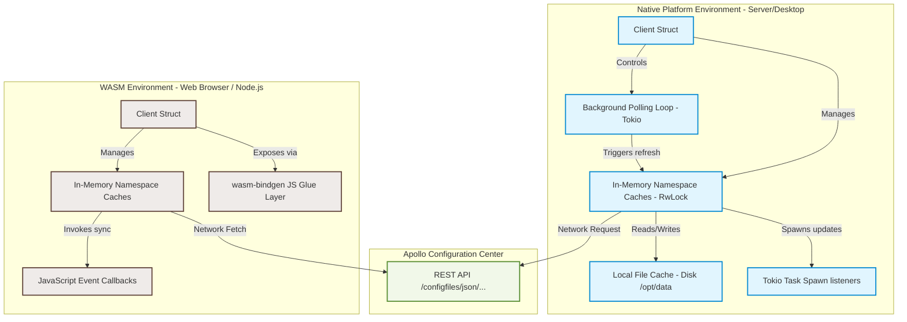

# SDD Architectural Design Viewpoint

This document details the architectural structure, context, compile-time configurations, and runtime execution patterns of the `apollo-rust-client`.

---

## 1. Context and Architecture Diagram

The `apollo-rust-client` operates as a central middleware library connecting application consumers to remote Apollo Configuration Services. It exhibits two distinct execution models depending on the targeted compilation target: **Native (Desktop/Server)** or **WebAssembly (Browser/NodeJS)**.



---

## 2. Platform-Specific Design Differences

To support highly disparate computing models, the client implements platform-specific adaptations:

| Design Dimension | Native Target (`not(target_arch = "wasm32")`) | WebAssembly Target (`target_arch = "wasm32"`) |
| :--- | :--- | :--- |
| **Concurrency Model** | Multi-threaded asynchronous execution (futures/tokio). | Single-threaded synchronous/asynchronous execution loop (Web API/Promise). |
| **Task Spawning** | Spawns background OS tasks via `tokio::spawn`. | Uses single-threaded `wasm_bindgen_futures::spawn_local`. |
| **Caching Tier** | Multi-level cache: Memory + Persistent Local Storage (disk). | Single-level cache: In-Memory cache only. |
| **Listener Dispatch** | Spawns separate task thread (`tokio::spawn`) to prevent deadlocks. | Invokes synchronously via `js_sys::Function::call2`. |
| **Configuration Retrieval** | Client returns a strongly-typed `Namespace` enum to Rust code. | Client returns raw `Cache` instance directly to JS. |
| **Resource Cleanup** | Managed automatically by Rust's RAII drop implementation. | Requires JavaScript context to call `.free()` manually on WASM objects. |

---

## 3. Structural Design & Conditional Compilation (`cfg_if!`)

Structural design adaptations are resolved at compile time using the standard `cfg_if::cfg_if!` macro. This eliminates platform overhead and ensures compiled packages are minimal.

### 3.1 Namespace Retrieval Compilation Signature
Depending on target compilation flags, the public client API undergoes interface morphing:

```rust
// Native Rust Compilation: Returns strongly typed Enum Namespace
pub async fn namespace(&self, namespace: &str) -> Result<namespace::Namespace, Error>;

// WebAssembly Compilation: Returns raw Javascript-wrapped Cache class
#[wasm_bindgen(js_name = "namespace")]
pub async fn namespace_wasm(&self, namespace: &str) -> Result<wasm_bindgen::JsValue, Error>;
```

### 3.2 Event Listener Function Aliasing
The type definition of observers changes to reflect thread safety guarantees needed by native multi-threading:

```rust
cfg_if::cfg_if! {
    if #[cfg(target_arch = "wasm32")] {
        // WASM: Does not require Send + Sync bounds as WASM environment is single-threaded
        pub type EventListener = Arc<dyn Fn(Result<Namespace, Error>)>;
    } else {
        // Native: Requires Send + Sync bounds to enable cross-thread messaging
        pub type EventListener = Arc<dyn Fn(Result<Namespace, Error>) + Send + Sync>;
    }
}
```

---

## 4. Execution Viewpoint

### 4.1 Native Background Refresh Loop
When `Client::start()` is called on a native environment:
1. Spawns an async background task via `tokio::spawn`.
2. Loops continuously while the `running` shared boolean flag remains `true`.
3. In each iteration:
   - Locks the namespace cache directory (`self.namespaces.read()`).
   - Copies reference counts of all caches.
   - Drops the locks to avoid blocking concurrent configuration readers.
   - Sequentially runs `cache.refresh()` on each namespace.
   - Sleeps the current task for the configured interval (defaults to **30 seconds**) using `tokio::time::sleep()`.

### 4.2 WebAssembly Integration Lifecycle
For WASM targets:
1. JavaScript invokes `let client = new Client(config);`.
2. The JS runtime allocates heap spaces inside the WASM linear memory layout.
3. Network requests use standard `fetch` APIs bridged through `reqwest` WASM capabilities.
4. **Memory Lifespans**: Because Javascript garbage collection does not clean up Rust allocated structures directly, calling `client.free()` manually from the JS context triggers memory deallocation on the WASM heap to prevent serious browser memory leaks.
