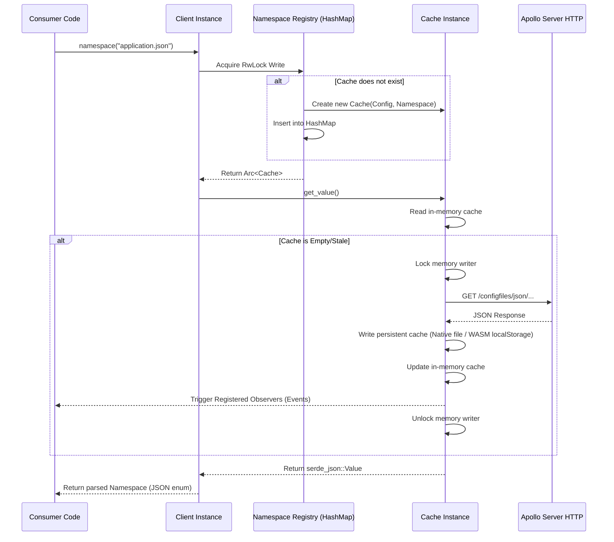

# SDD Interface Design Viewpoint

This document details the external and internal interfaces of the `apollo-rust-client`, detailing how it binds to JS/WASM runtimes, communicates with Apollo Servers, and coordinates internally.

---

## 1. External Interfaces

### 1.1 WebAssembly & JavaScript Bindings (`wasm-bindgen`)

The client exports standard JavaScript classes to enable integration within Node.js and browser environments. The generated bindings interface with standard Promise structures.

#### Class `ClientConfig` (JavaScript API)
- **Constructor**:
  ```javascript
  constructor(appId: string, configServer: string, cluster: string);
  ```
- **Properties**:
  - `secret: string | null` (Getter/Setter)
  - `label: string | null` (Getter/Setter)
  - `ip: string | null` (Getter/Setter)
  - `allowInsecureHttps: boolean | null` (Getter/Setter)

#### Class `Client` (JavaScript API)
- **Constructor**:
  ```javascript
  constructor(config: ClientConfig);
  ```
- **Methods**:
  - `start(): Promise<void>`: Spawns the async listener refresh loop (WASM).
  - `stop(): Promise<void>`: Stops the background loop.
  - `namespace(namespace: string): Promise<Cache>`: Retrieves a Javascript reference to the `Cache` object.
  - `add_listener(namespace: string, callback: (data: any, error: string | null) => void): Promise<void>`: Registers an observer callback.

#### Class `Cache` (JavaScript API)
- **Methods**:
  - `get_string(key: string): string | null`
  - `get_int(key: string): number | null`
  - `get_float(key: string): number | null`
  - `get_bool(key: string): boolean | null`

> [!WARNING]
> **Manual Memory Management**: JS runtimes must call `.free()` on all instances of `ClientConfig`, `Client`, and `Cache` created from WASM once they are out of scope. If ignored, the underlying memory allocated in the WebAssembly heap will leak.

---

### 1.2 Apollo HTTP Integration Protocol

The library retrieves configurations by directly polling Apollo Server JSON endpoints.

- **Request Type**: HTTP `GET`
- **Request URL Layout**:
  ```
  {config_server}/configfiles/json/{app_id}/{cluster}/{namespace}
  ```
- **Query Parameters**:
  - `ip` (Optional): Appended as `?ip={ip_val}` for targeted grayscale releases.
  - `label` (Optional): Appended as `?label={label_val}` for target canary rules.

#### Request Headers & Authentication Signature
If `secret` authentication is configured, the client generates custom HMAC-SHA1 headers on each request:

| Header | Description / Value Format |
| :--- | :--- |
| `timestamp` | Current Unix time in milliseconds (e.g., `1576478257344`). |
| `Authorization` | Signature format: `Apollo {app_id}:{signature}`. |

#### Signature Algorithm
The HMAC-SHA1 signature is constructed as follows:
1. Parse the request URL to extract the path and query string:
   `path_and_query = "/configs/{app_id}/{cluster}/{namespace}?ip={ip}"`
2. Formulate the signing input string:
   `input = "{timestamp_millis}\n{path_and_query}"`
3. Generate the HMAC-SHA1 digest using the `secret` key.
4. Encode the resulting digest byte array as standard **Base64** text.

```rust
// Signature generation signature (Internal)
fn sign(timestamp: i64, url: &str, secret: &str) -> Result<String, Error>;
```

### 1.3 Testing Mock Server (Docker Compose / WireMock)
To decouple the test suite from external, remote Apollo servers (such as the now retired CTrip Apollo community demo server), the client repository includes a standard local Docker Mock Server setup using WireMock.

- **Docker Service Orchestration**: Defined in the [docker-compose.yml](file:///Users/q/workspace/apollo-rust-client/docker-compose.yml) in the root directory.
- **WireMock Stub Mappings**: Stored as JSON definitions under [tests/wiremock/mappings/](file:///Users/q/workspace/apollo-rust-client/tests/wiremock/mappings/).
- **Dynamic Config Routing**: Test clients read the server destination from the `APOLLO_TEST_SERVER` environment variable, falling back to `http://localhost:8080` (where the local WireMock Docker container is mapped).
- **Self-Managed Test Lifecycle**: The [scripts/test.sh](file:///Users/q/workspace/apollo-rust-client/scripts/test.sh) script automatically starts the WireMock Docker container before testing (`docker compose up -d`), waits for the server to be fully responsive, executes the test suite, and reliably tears down all containers on completion using a shell `trap` handler. This keeps the GitHub Actions workflow extremely simple and requires zero manual container management by local developers.

---

## 2. Internal Interfaces

The coordination between internal modules is asynchronous and thread-safe.



### 2.1 Format Detection Flow
When converting a raw configuration response, `namespace::get_namespace` analyzes the name string:
1. Splitting the string on dot characters (`.`).
2. If no extensions are found, format returns `NamespaceType::Properties`.
3. If extensions exist, it parses the trailing substring:
   - `"json"` $\rightarrow$ `NamespaceType::Json`
   - `"yaml" | "yml"` $\rightarrow$ `NamespaceType::Yaml`
   - `"xml"` $\rightarrow$ `NamespaceType::Xml` (currently unsupported)
   - Other extension $\rightarrow$ `NamespaceType::Text` (default fallback)
